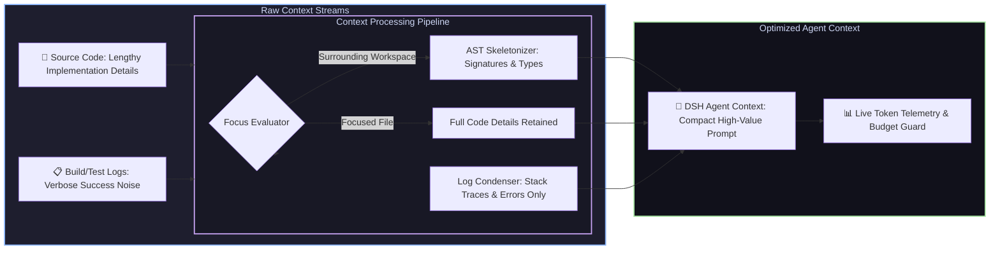

# 📦 @goodandready/dsh-context-lens

<div align="center">

<h3>AST Code Skeletonizer, Terminal Log Condenser & Token Budget Guard for DeepSeek Harness</h3>

<p align="center">
  <a href="https://www.npmjs.com/package/@goodandready/dsh-context-lens"></a>
  <a href="LICENSE"></a>
  <a href="https://github.com/topics/dsh-plugin"></a>
  <a href="https://nodejs.org"></a>
</p>

<!-- Showcase Button -->
<p align="center">
  <a href="https://goodandready.app/"></a>
</p>

<p align="center">
  <a href="README.md"><b>🇬🇧 English</b></a> •
  <a href="README.ru.md"><b>🇷🇺 Русский</b></a> •
  <a href="README.zh.md"><b>🇨🇳 中文说明</b></a>
</p>

<table align="center">
  <tr>
    <td align="center">
      ⭐ <strong>If you like this plugin, please star it on GitHub</strong> — it shows me that the plugin is useful to you and motivates me to keep developing it.
      <br><br>
      🐛 <strong>If you find a bug or would like to request a feature</strong>, open a GitHub issue in any language — I will review your proposal and implement useful suggestions in a future plugin version.
    </td>
  </tr>
</table>

</div>

---

## ⚡ Overview & The Problem

Large codebase contexts and verbose build/test logs quickly fill the LLM context window, waste token budget, slow down inference, and cause agent hallucination.

**`dsh-context-lens`** solves this by providing:
1. **Active Focus Scoping**: Keeping full fidelity for files currently being edited, while collapsing surrounding workspace files into lightweight AST skeletons.
2. **Multi-Language AST Skeletonization**: Extracting structural types, classes, and method signatures across TypeScript, JavaScript, Python, Go, C/C++, Rust, and SQL, cutting raw code size by **70–85%**.
3. **Intelligent Terminal Log Compression**: Stripping noisy passing test lines and build boilerplate while preserving critical error stack traces and failure windows, cutting log size by up to **90%**.
4. **Session Token Telemetry & Budget Guard**: Live tracking of token savings with configurable budget alerts and visual indicators in the DSH Web UI.



---

## ✨ Full Feature Breakdown

### 1. 🧬 Multi-Language AST Structural Skeletonizer
* **Supported Languages**: TypeScript, JavaScript, Python, Go, C/C++, Rust, and SQL DDL.
* **Structural Preservation**: Retains imports, classes, structs, interfaces, exported types, function signatures, and doc comments while discarding inner implementation bodies.
* **Multiline Signature Support**: Seamlessly accumulates complex multiline generic arguments, return types, and parameter lists up to block delimiters.
* **Pure Regex Implementation**: Zero heavy native dependencies or binary parser overhead; runs lightning-fast across any platform.

### 2. 📋 Heuristic Test & Build Log Condenser
* **Supported Test Runners & Tools**: Jest, Vitest, Pytest, Go test, Cargo, Webpack, Vite, TSC, Maven, Gradle.
* **Targeted Extraction**: Identifies and preserves critical error messages, stack traces, assertion differences (`Expected ... Received ...`), and failure context windows.
* **3 Aggressiveness Modes**:
  - `raw`: Removes simple noise lines while keeping general execution order.
  - `balanced`: Preserves failure sections with surrounding context windows (default).
  - `aggressive`: Extracts strictly error lines and stack frames.
* **ANSI Stripping**: Cleans terminal escape codes and color formatting before processing.

### 3. 🎯 Active Path Focus Scoping (`context_lens_focus`)
* Allows designating specific files or folders as active working targets for the current task.
* Files inside focus remain uncompressed; non-focused dependencies are automatically served as structural skeletons.
* Focus state is strictly scoped per session (`sessionId`) and can be inspected or cleared instantly via UI or API.

### 4. 📊 Token Savings Tracking & Budget Telemetry
* Calculates exact tokens before and after compression using accurate token estimation.
* Tracks cumulative tokens saved, compression ratio, and session budget percentage.
* Configurable warning threshold (`budgetAlertPercent`) dynamically alerts when the session budget approaches depletion.

### 5. 🖥️ Visual Surfaces & Dual Sidebar Integration
Context Lens shares the unified `.cl-*` design language and `--dsw-alias-*` token system with `dsh-clinebot`:
* **Conversation Header Chip**: Mounted in `conversation.session.header.utilities` (`order: 7`). Always displays efficiency badges (`◐ Lens`, `◐ <N>%`, or `⚠` alert) with an interactive dropdown Popover showing savings details and recent operations.
* **Dual Sidebar Compatibility**: Supports both native DeepSeek Harness right sidebar (`ctx.sidebarRightTabs` + `sidebar.right.pane.tab` slot) and legacy `dsh-better-sidebar` with non-conflicting IDs.
* **ErrorBoundary Protection**: Every UI component (`PluginCard`, `LensTab`, `StatusPanel`) is isolated inside React error boundaries with instant retry buttons, preventing parent UI crashes.
* **One-Click In-App Updater**: Settings card displays live version checks against npm with a single-click update trigger.

---

## 🛠️ Agent Tools Reference (5 Tools)

All tools strictly conform to the DeepSeek Harness tool specification by providing `output.render` returning structured `ContentBlock[]` arrays (`[{ type: 'text', text: ... }]`), ensuring 100% session stability with core LLM stream processors.

| Tool Name | Parameters | Description |
|---|---|---|
| `context_lens_focus` | `paths: string[]`, `sessionId?: string` | Sets active focus files/folders for the session; collapses surrounding workspace into AST skeletons |
| `context_lens_compress_log` | `text: string` *(or `log`)*, `mode?: "raw"|"balanced"|"aggressive"`, `maxLines?: number`, `auto?: boolean` | Condenses terminal and test outputs, keeping only stack traces and failure windows |
| `context_lens_compress_code` | `code: string`, `language?: string`, `maxDepth?: number`, `filePath?: string`, `sessionId?: string` | Generates a clean structural AST skeleton from raw source code |
| `context_lens_track` | `sessionId?: string` | Returns real-time cumulative token savings, history, and budget status for the session |
| `context_lens_reset` | `sessionId?: string` | Resets token tracker counters and compression history at the start of new tasks |

---

## 🔌 HTTP API Reference

| Endpoint | Method | Security Checks | Description |
|---|---|---|---|
| `/dsh-context-lens/status` | `GET` | Open (safe read) | Returns session token savings stats, active focus paths, and compression history |
| `/dsh-context-lens/clear-focus` | `POST` | Loopback / Same-Origin | Clears focused paths for the specified session (rejects GET with 405) |
| `/dsh-context-lens/compress-preview` | `POST` | Loopback / Same-Origin | Preview log compression with 256KB body size limit and `maxLines` clamping (1–5000) |
| `/api/dsh-context-lens/update` | `GET`, `POST` | Loopback + Security Header | In-app plugin updater checking npm registry and executing safe background updates |

---

## ⚙️ Configuration Reference (`settings.yaml`)

Settings can be modified via `settings.yaml` or directly in the DSH Web UI under **Settings → Plugins → Context Lens**.

```yaml
dsh-context-lens:
  compressionMode: balanced        # Log compression mode: 'raw', 'balanced', or 'aggressive'
  astSkeletonMaxDepth: 3          # Maximum depth level for AST signature traversal (1..10)
  tokenSavingsTracking: true      # Track and display live token savings
  autoCompressThreshold: 4000     # Auto-compression character threshold (0 to disable)
  budgetLimit: 100000             # Session token budget limit
  budgetAlertPercent: 90          # Budget percentage threshold triggering warning badge (50..99)
  autoCollapse: true              # Display warning in UI when budget is nearly exhausted
```

| Parameter | Type | Default | Description |
|---|---|---|---|
| `compressionMode` | `string` | `balanced` | Default log compression aggressiveness (`raw`, `balanced`, `aggressive`) |
| `astSkeletonMaxDepth` | `number` | `3` | Maximum nesting depth for AST signature parsing (1 to 10) |
| `tokenSavingsTracking` | `boolean` | `true` | Track token savings before/after compression |
| `autoCompressThreshold` | `number` | `4000` | Auto-compress terminal logs exceeding this character length (0 to disable) |
| `budgetLimit` | `number` | `100000` | Total token budget limit allocated per session |
| `budgetAlertPercent` | `number` | `90` | Budget alert threshold percentage triggering warnings (50 to 99) |
| `autoCollapse` | `boolean` | `true` | Display low-budget warning badge in settings card and header chip |

---

## 📦 Quick Installation

```bash
dsh plugin --profile web add @goodandready/dsh-context-lens
```

> [!TIP]
> After installation, reload the DSH Web UI or restart the service (`systemctl --user restart dsh-web`) to activate context compression tools.

---

## 📄 License

MIT © [GooDAnDReaDY](https://github.com/GooDAnDReaDY)
