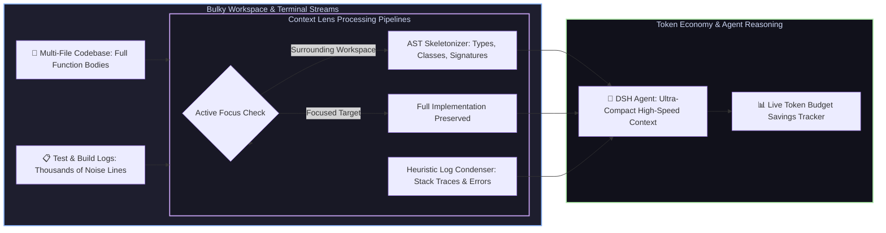

# 📦 @goodandready/dsh-context-lens

<div align="center">

<h3>Intelligent AST Code Skeletonizer, Context Token Compressor & Log Condenser for DeepSeek Harness</h3>

<p align="center">
  <a href="https://www.npmjs.com/package/@goodandready/dsh-context-lens"></a>
  <a href="LICENSE"></a>
  <a href="https://github.com/topics/dsh-plugin"></a>
  <a href="https://nodejs.org"></a>
</p>

<!-- Showcase Catalog Button -->
<p align="center">
  <a href="https://goodandready.app/"></a>
</p>

<p align="center">
  <a href="README.md"><b>🇬🇧 English</b></a> •
  <a href="README.ru.md"><b>🇷🇺 Русский</b></a> •
  <a href="README.zh.md"><b>🇨🇳 中文说明</b></a>
</p>

</div>

---

## ⚡ Overview

**`dsh-context-lens`** optimizes the context window and token budget of **DeepSeek Harness** agents.

Large context windows are expensive, prone to model distraction, and vulnerable to rate limits. When agents inspect multi-file codebases or run bulky test suites, thousands of tokens are wasted on boilerplate function bodies, passing test logs, and build artifacts. 

`dsh-context-lens` introduces **active path focusing, AST structural code skeletonization (JS/TS/Python/Go), and fast O(n) heuristic log compression**, shrinking context consumption by **up to 85%** while keeping 100% of essential architectural interfaces and failure traces.



---

## ✨ Key Capabilities & Modules

### 1. 🧬 Multi-Language AST Code Skeletonizer (`lib/ast/skeletonizer.js`)
* Automatically extracts structural interfaces, function signatures, classes, types, and exports across **TypeScript, JavaScript, Python, Go, Rust, and Java**;
* Supports `pub async fn`, `async fn`, `pub(crate)` and `pub(super)` in Rust;
* Retains JSDoc, docstrings, and structural comments preceding definitions;
* Drops internal function implementations, loops, and repetitive boilerplate while preserving indentation and export declarations;
* Allows the agent to understand entire multi-package repository architectures without loading tens of thousands of implementation tokens.

### 2. 🗜️ Fast Heuristic Log Condenser (`lib/compression/log-compressor.js`)
* High-performance $O(n)$ heuristic line filter for test runners and build tools (Jest, Vitest, Pytest, Go test, NPM, Webpack, Cargo, Maven/Gradle);
* Strips terminal ANSI escape color sequences before evaluating regex patterns;
* Automatically filters out passing test noise (`PASS`, `✓`, `ok`) and build notices;
* Retains critical error lines, stack traces, assertion failures (`Expected ... Received ...`), and failure context windows;
* 3 Aggressiveness Modes: `raw`, `balanced`, and `aggressive`.

### 3. 🎯 Active Path Focus Scoping (`context_lens_focus`)
* Dynamically sets a list of active files or directories currently being edited;
* Files outside the focus list are automatically presented to the agent as lightweight AST skeletons.

### 4. 📊 Token Savings Tracking & Dashboard (`lib/tokens/tracker.js` & `lib/client.js`)
* Measures exact token counts before and after compression;
* Calculates cumulative session token savings and displays live efficiency percentage badges in the DSH interface;
* Enforces Token Budget Guard limits with alert warnings when exceeding 90% budget.

---

## 🛠️ Agent Tools Reference (4 Tools)

| Tool Name | Parameters | Description |
|---|---|---|
| `context_lens_focus` | `paths: string[]`, `maxDepth?: number` | Designates active focus files/folders; collapses surrounding workspace into AST skeletons |
| `context_lens_compress_log` | `text: string` *(or `log`)*, `mode?: "raw"\|"balanced"\|"aggressive"`, `maxLines?: number`, `auto?: boolean` | Condenses terminal/test outputs, keeping only stack traces and failure windows |
| `context_lens_compress_code` | `code: string`, `language?: string`, `maxDepth?: number`, `filePath?: string` | Generates a clean structural AST skeleton from raw source code |
| `context_lens_stats` | *(none)* | Returns real-time cumulative token savings, history, and budget status |

---

## 📦 Quick Installation

```bash
dsh plugin --profile web add @goodandready/dsh-context-lens
```

> [!IMPORTANT]
> Restart DSH Web UI after installation (`systemctl --user restart dsh-web`) to activate context compression tools.

---

## ⚙️ Configuration Reference (`settings.yaml`)

```yaml
dsh-context-lens:
  compressionMode: balanced        # 'raw', 'balanced', or 'aggressive'
  astSkeletonMaxDepth: 3          # Maximum depth level for AST signature traversal (1..10)
  tokenSavingsTracking: true      # Track and display live token savings
  autoCompressThreshold: 4000     # Auto-compression character threshold (0 to disable)
  budgetLimit: 100000             # Session token budget limit
  autoCollapse: true              # Auto-collapse UI when budget is nearly exhausted
```

---

## 📝 Version History

### v0.1.10
* **Fix**: Register session header chip in `conversation.session.header.utilities` (`order: 7`).
* **Fix**: Ensure chip is always visible (`◐ Lens` on initial session, `◐ <N>%` when savings available, `⚠` on low budget).
* **Feature**: Interactive dropdown Popover on chip click: token savings breakdown, budget progress bar, recent operations, and refresh button.

### v0.1.9
* **Fix**: Remove obsolete kernel modules from client injects for DSH 0.1.2-rc.1 compatibility.

### v0.1.8
* **Fix**: Support both `text` and `log` parameter names in `context_lens_compress_log`.
* **Fix**: Cross-platform path resolution in unit tests on Windows (`fileURLToPath`).
* **Fix**: Dynamic propagation of `budgetLimit` configuration into token tracker.
* **Fix**: ANSI terminal escape sequence stripping for colored logs.
* **Fix**: Expanded Rust syntax support (`pub async fn`, `pub(crate)`) and proper `#` comment prefix for Python.

---

## 📄 License

MIT © [GooDAnDReaDY](https://github.com/GooDAnDReaDY)
