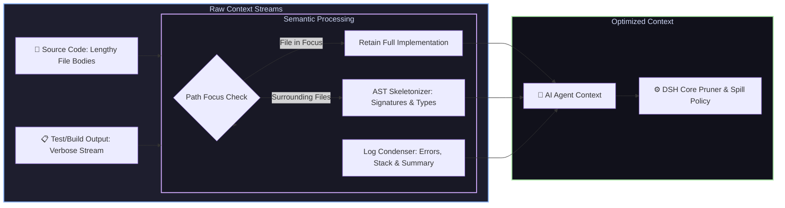

# 📦 @goodandready/dsh-context-lens

<h3>Semantic AST Code Skeletonizer & Test Log Condenser for DeepSeek Harness</h3>

  
  
  
  

<!-- Showcase Button -->

  

  <a href="README.md"><b>🇬🇧 English</b></a> •
  <a href="README.ru.md"><b>🇷🇺 Русский</b></a> •
  <a href="README.zh.md"><b>🇨🇳 中文说明</b></a>

<table align="center">
  <tr>
    <td align="center">
      ⭐ <strong>If you like this plugin, please star it on GitHub</strong> — it shows me that the plugin is useful to you and motivates me to keep developing it.
        
      🐛 <strong>If you find a bug or would like to request a feature</strong>, open a GitHub issue in any language — I will review your proposal and implement useful suggestions in a future plugin version.
    </td>
  </tr>
</table>

---

## ⚡ Overview & Semantic Compression Focus

> **Note on DSH Core vs Plugin Responsibility:**  
> Context budgeting, token counting, tool result pruning (`head/middle/tail`), and spilling long results to disk (`dsh-spill-policy`, `dsh-compaction-tool-result-pruner`, `dsh-token-meter`) are natively managed by the **DSH core (>= 0.1.5)**.  
> **`dsh-context-lens`** focuses strictly on what the core does not do — **semantic compression**:
> 1. **AST Code Skeletons**: Signatures, interfaces, exported types, and doc comments instead of whole function/method bodies across 9+ languages.
> 2. **Path-Based Focus**: Full code for active editing targets while surrounding workspace files remain skeletonized.
> 3. **Test & Build Log Compression**: Failures, errors, stack traces, and test summary instead of raw multi-megabyte terminal streams.

```mermaid
graph LR
    subgraph RawContext [Raw Context Streams]
        Code[📁 Source Code: Lengthy File Bodies] --> Lens[dsh-context-lens Semantic Engine]
        Logs[📋 Test/Build Output: Verbose Stream] --> Lens
    end

    subgraph Lens [Semantic Processing]
        Lens --> Focus{Path Focus Check}
        Focus -->|File in Focus| FullCode[Retain Full Implementation]
        Focus -->|Surrounding Files| AST[AST Skeletonizer: Signatures & Types]
        Lens --> LogCompress[Log Condenser: Errors, Stack & Summary]
    end

    subgraph Output [Optimized Context]
        FullCode --> Agent[🤖 AI Agent Context]
        AST --> Agent
        LogCompress --> Agent
        Agent --> Core[⚙️ DSH Core Pruner & Spill Policy]
    end

    style RawContext fill:#1e1e2e,stroke:#89b4fa,stroke-width:2px,color:#cdd6f4
    style Lens fill:#181825,stroke:#cba6f7,stroke-width:2px,color:#cdd6f4
    style Output fill:#11111b,stroke:#a6e3a1,stroke-width:2px,color:#cdd6f4
```

---

## ✨ Features

### 1. 🧬 Multi-Language AST Structural Skeletonizer
* **Supported Languages**: TypeScript, JavaScript, Python, Go, C/C++, Rust, Java, and SQL DDL.
* **Structural Preservation**: Retains imports, classes, structs, interfaces, exported types, function signatures, and doc comments while discarding inner implementation bodies.
* **Multiline Signature Support**: Seamlessly accumulates complex multiline generic arguments, return types, and parameter lists up to block delimiters.
* **Pure Regex Implementation**: Zero heavy native dependencies or binary parser overhead; runs lightning-fast across any platform.

### 2. 📋 Intelligent Test & Build Log Condenser
* **Supported Test Runners & Tools**: Jest, Vitest, Pytest, `node --test`, Go test, Cargo, Webpack, Vite, TSC, Maven, Gradle.
* **Targeted Extraction**: Identifies and preserves critical error messages, stack traces, assertion differences (`Expected ... Received ...`), and failure context windows.
* **Successful Run Summarization**: Automatically collapses passing runs (0 failures) into concise summary lines.
* **Auto-Mode Discrimination**: Evaluates command context and text signatures to ensure normal non-test outputs are preserved untouched for core pruning.
* **3 Aggressiveness Modes**:
  - `raw`: Removes noise lines while keeping general execution order.
  - `balanced`: Preserves failure sections with surrounding context windows (default).
  - `aggressive`: Extracts strictly error lines and stack frames.

### 3. 🎯 Path Focus Management
* Designate specific files or folders as active working targets for the current task.
* Files in focus bypass AST skeletonization, returning complete implementation code.
* Focus state is strictly scoped per session (`sessionId`).

---

## 🛠️ Agent Tools Reference (Consolidated to 2 Tools)

All tools strictly conform to the DeepSeek Harness tool specification by providing `output.render` returning structured `ContentBlock[]` arrays (`[{ type: 'text', text: ... }]`), ensuring 100% session stability.

| Tool Name | Action / Mode | Parameters | Description |
|---|---|---|---|
| `context_lens_code` | `action: "skeleton"` (default) | `code`, `language?`, `maxDepth?`, `filePath?`, `sessionId?` | Generates a clean structural AST skeleton from raw source code (or returns full code if file is in session focus) |
| `context_lens_code` | `action: "focus"` | `paths: string[]`, `sessionId?` | Sets active focus file paths or patterns for the current session |
| `context_lens_code` | `action: "get_focus"` | `sessionId?` | Retrieves active focus paths for the session |
| `context_lens_code` | `action: "clear_focus"` | `sessionId?` | Clears focus paths for the session |
| `context_lens_log` | N/A | `text` *(or `log`)*, `mode?`, `maxLines?`, `auto?`, `command?` | Compresses test and build output logs, preserving failures, stack traces, and summary. In `auto: true`, only runs on recognized test/build outputs |

---

## ⚙️ Configuration Schema

Configured via the DSH Settings page (`plugins.row.config` / `plugins.item`):

| Property | Type | Default | Description |
|---|---|---|---|
| `compressionMode` | `string` | `'balanced'` | Log compression aggressiveness (`raw`, `balanced`, `aggressive`) |
| `astSkeletonMaxDepth` | `number` | `3` | Max depth for AST skeleton generation |
| `autoCompressThreshold` | `number` | `4000` | Character threshold for auto-compressing test/build logs (0 to disable) |

---

## 📄 License

MIT © [GooDAnDReaDY](https://github.com/GooDAnDReaDY)