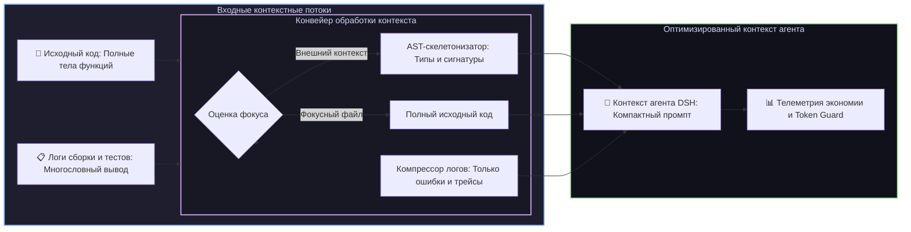

# 📦 @goodandready/dsh-context-lens

<div align="center">

<h3>AST-скелетонизатор кода, компрессор терминальных логов и Token Guard для DeepSeek Harness</h3>

<p align="center">
  <a href="https://www.npmjs.com/package/@goodandready/dsh-context-lens"></a>
  <a href="LICENSE"></a>
  <a href="https://github.com/topics/dsh-plugin"></a>
  <a href="https://nodejs.org"></a>
</p>

<!-- Кнопка перехода на витрину -->
<p align="center">
  <a href="https://goodandready.app/"></a>
</p>

<p align="center">
  <a href="README.md"><b>🇬🇧 English</b></a> •
  <a href="README.ru.md"><b>🇷🇺 Русский</b></a> •
  <a href="README.zh.md"><b>🇨🇳 中文说明</b></a>
</p>

<table align="center">
  <tr>
    <td align="center">
      ⭐ <strong>Если вам нравится этот плагин, поставьте ему Star на GitHub</strong> — это покажет мне, что плагин полезен, и добавит мотивации продолжать его развитие.
      <br><br>
      🐛 <strong>Если вы нашли баг или хотите предложить новую функцию</strong>, создайте Issue на GitHub на любом языке — я рассмотрю предложение и реализую полезные улучшения в одной из следующих версий плагина.
    </td>
  </tr>
</table>

</div>

---

## ⚡ Обзор и решаемая проблема

При анализе крупных проектов и выполнении тестов контекстное окно языковой модели мгновенно заполняется реализацией второстепенных файлов и простынями логов. Это приводит к перерасходу токенов, росту задержек генерации и потере внимания агента.

**`dsh-context-lens`** решает эту проблему комплексно:
1. **Фокусировка на активных путях (`context_lens_focus`)**: Редактируемые файлы передаются агенту целиком, а вспомогательные файлы рабочей зоны сворачиваются в легковесные AST-каркасы.
2. **Многоязыковая AST-скелетонизация**: Сжатие кода на **70–85%** с сохранением классов, типов, методов и сигнатур (TypeScript, JavaScript, Python, Go, C/C++, Rust, SQL).
3. **Эвристическая компрессия логов**: Удаление шума успешных проверок с сохранением ключевых ошибок и стек-трейсов, сжатие логов до **90%**.
4. **Сессионная телеметрия токенов и Token Guard**: Отслеживание экономии в реальном времени, визуальные бейджи и алерты при исчерпании лимита бюджета.



---

## ✨ Полный разбор возможностей

### 1. 🧬 Многоязыковой AST-скелетонизатор
* **Поддерживаемые языки**: TypeScript, JavaScript, Python, Go, C/C++, Rust, SQL DDL.
* **Сохранение архитектурной структуры**: Оставляет импорты, классы, интерфейсы, сигнатуры функций и документирующие комментарии, вырезая громоздкие тела методов.
* **Многострочные сигнатуры**: Корректно аккумулирует сложные типизированные параметры и возвращаемые промисы до терминаторов блоков.
* **Чистый регулярный парсер**: Нулевой оверхед, отсутствие бинарных парсеров и мгновенная работа на любой ОС.

### 2. 📋 Эвристический компрессор логов тестирования и сборки
* **Поддерживаемые инструменты**: Jest, Vitest, Pytest, Go test, Cargo, Webpack, Vite, TSC, Maven, Gradle.
* **Точечная фильтрация**: Сохраняет сообщения об ошибках, стек-трейсы, различия в assert (`Expected ... Received ...`) и строки контекста падений.
* **3 режима сжатия**:
  - `raw`: Фильтрация очевидного шума с сохранением общего хода выполнения.
  - `balanced`: Баланс между сжатием и контекстом вокруг упавших тестов (по умолчанию).
  - `aggressive`: Выделение строго строк ошибок и фреймов вызовов.
* **Очистка ANSI**: Автоматическое удаление цветовых кодов терминала.

### 3. 🎯 Сессионная фокусировка (`context_lens_focus`)
* Задаёт список рабочих файлов или каталогов, редактируемых в рамках текущей задачи.
* Фокус строго изолирован в разрезе сессии (`sessionId`).
* Сброс фокуса доступен в один клик через кнопку в интерфейсе или вызов `context_lens_focus` с пустым списком.

### 4. 📊 Трекер экономии токенов и Token Guard
* Расчёт реального расхода до и после сжатия.
* Отображение суммарно сэкономленных токенов, процента оптимизации и шкалы сессионного бюджета.
* Настраиваемый порог предупреждения (`budgetAlertPercent`) с динамической сменой статуса индикатора.

### 5. 🖥️ Визуальные интерфейсы и совместимость с боковыми панелями
Context Lens оформлен по единому стандарту дизайн-системы `.cl-*` и токенов `--dsw-alias-*`:
* **Индикатор в шапке диалога**: Размещён в слоте `conversation.session.header.utilities` (`order: 7`). Показывает статус (`◐ Lens`, `◐ <N>%` или `⚠`) и открывает интерактивный Popover с метриками и историей операций.
* **Поддержка двух боковых панелей**: Совместим как с нативной правой панелью DSH (`ctx.sidebarRightTabs` + слот `sidebar.right.pane.tab`), так и с легаси `dsh-better-sidebar`.
* **Изоляция сбоев (ErrorBoundary)**: Все визуальные компоненты обёрнуты в защитные границы React с кнопкой повтора («Retry»).
* **Встроенный One-Click апдейтер**: Проверка обновлений в npm и безопасная установка в один клик из карточки настроек.

---

## 🛠️ Справочник инструментов агента (5 инструментов)

Все инструменты строго соответствуют контракту DSH: метод `output.render` возвращает массив `ContentBlock[]` (`[{ type: 'text', text: ... }]`), исключая повреждение сессий в ядре `@deepseek-ai/dsh-llm`.

| Имя инструмента | Параметры | Описание |
|---|---|---|
| `context_lens_focus` | `paths: string[]`, `sessionId?: string` | Назначает активные рабочие файлы сессии; сворачивает внешнее окружение в AST-каркасы |
| `context_lens_compress_log` | `text: string` *(или `log`)*, `mode?: "raw"|"balanced"|"aggressive"`, `maxLines?: number`, `auto?: boolean` | Сжимает вывод тестов и терминала, сохраняя только ошибки и контекст падений |
| `context_lens_compress_code` | `code: string`, `language?: string`, `maxDepth?: number`, `filePath?: string`, `sessionId?: string` | Формирует структурный AST-скелет из исходного кода |
| `context_lens_track` | `sessionId?: string` | Возвращает накопленную статистику экономии токенов, историю и статус бюджета сессии |
| `context_lens_reset` | `sessionId?: string` | Сбрасывает накопленные счётчики и историю сжатий при старте новой задачи |

---

## 🔌 HTTP API плагина

| Маршрут | Метод | Защита и проверки | Описание |
|---|---|---|---|
| `/dsh-context-lens/status` | `GET` | Открытый (safe read) | Возвращает сессионную статистику, активные пути фокуса и историю сжатий |
| `/dsh-context-lens/clear-focus` | `POST` | Loopback / Same-Origin | Сбрасывает пути фокуса для указанной сессии (GET отклоняется с кодом 405) |
| `/dsh-context-lens/compress-preview` | `POST` | Loopback / Same-Origin | Предпросмотр сжатия лога с лимитом тела 256 КБ и клампингом `maxLines` (1–5000) |
| `/api/dsh-context-lens/update` | `GET`, `POST` | Loopback + заголовок защиты | Модуль фонового обновления плагина из официального реестра npm |

---

## ⚙️ Справочник настроек (`settings.yaml`)

Настройки доступны через `settings.yaml` или в интерфейсе DSH во вкладке **Настройки → Плагины → Context Lens**.

```yaml
dsh-context-lens:
  compressionMode: balanced        # Режим сжатия логов: 'raw', 'balanced', или 'aggressive'
  astSkeletonMaxDepth: 3          # Максимальная глубина обхода сигнатур AST (1..10)
  tokenSavingsTracking: true      # Отслеживание и отображение экономии токенов
  autoCompressThreshold: 4000     # Порог автосжатия логов в символах (0 для отключения)
  budgetLimit: 100000             # Сессионный лимит бюджета токенов
  budgetAlertPercent: 90          # Процент бюджета для вывода предупреждения (50..99)
  autoCollapse: true              # Отображение предупреждающего бейджа при исчерпании бюджета
```

| Параметр | Тип | По умолчанию | Описание |
|---|---|---|---|
| `compressionMode` | `string` | `balanced` | Базовый режим сжатия логов (`raw`, `balanced`, `aggressive`) |
| `astSkeletonMaxDepth` | `number` | `3` | Максимальная глубина вложенности AST-сигнатур (от 1 до 10) |
| `tokenSavingsTracking` | `boolean` | `true` | Расчёт сэкономленных токенов до и после сжатия |
| `autoCompressThreshold` | `number` | `4000` | Порог авто-сжатия терминального вывода (символов) |
| `budgetLimit` | `number` | `100000` | Выделенный бюджет токенов на одну сессию |
| `budgetAlertPercent` | `number` | `90` | Процент расхода бюджета для активации предупреждения (от 50 до 99) |
| `autoCollapse` | `boolean` | `true` | Отображение бейджа низкого бюджета в карточке настроек и шапке |

---

## 📦 Быстрая установка

```bash
dsh plugin --profile web add @goodandready/dsh-context-lens
```

> [!TIP]
> После установки перезагрузите страницу Web UI или перезапустите сервис (`systemctl --user restart dsh-web`) для активации инструментов контекста.

---

## 📄 Лицензия

MIT © [GooDAnDReaDY](https://github.com/GooDAnDReaDY)
