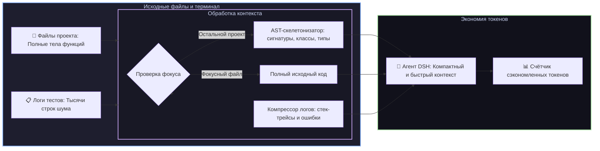

# 📦 @goodandready/dsh-context-lens

<div align="center">

<h3>Интеллектуальный AST-скелетонизатор кода, оптимизатор контекста и компрессор логов для DeepSeek Harness</h3>

<p align="center">
  <a href="https://www.npmjs.com/package/@goodandready/dsh-context-lens"></a>
  <a href="LICENSE"></a>
  <a href="https://github.com/topics/dsh-plugin"></a>
  <a href="https://nodejs.org"></a>
</p>

<!-- Обязательная кнопка перехода на витрину всех проектов -->
<p align="center">
  <a href="https://goodandready.app/"></a>
</p>

<p align="center">
  <a href="README.md"><b>🇬🇧 English</b></a> •
  <a href="README.ru.md"><b>🇷🇺 Русский</b></a> •
  <a href="README.zh.md"><b>🇨🇳 中文说明</b></a>
</p>

</div>

---

## ⚡ Обзор

**`dsh-context-lens`** оптимизирует контекстное окно и бюджет токенов агентов **DeepSeek Harness**.

Большие объёмы контекста приводят к высоким затратам токенов, замедлению генерации и быстрой перегрузке лимитов. При изучении крупных репозиториев или прогоне тестов тысячи токенов тратятся на однотипные тела функций, логи успешных тестов и сборку.

Плагин внедряет **фокусировку на активных файлах, AST-скелетонизацию исходного кода (JS/TS/Python/Go) и сверхбыструю эвристическую компрессию логов**, снижая расход контекста **до 85%** при сохранении 100% сигнатур типов, интерфейсов и сообщений об ошибках.



---

## ✨ Ключевые возможности

### 1. 🧬 Мультиязычный AST-скелетонизатор кода (`lib/ast/skeletonizer.js`)
* Извлекает структурные интерфейсы, сигнатуры функций, методы классов, типы и экспорты для **TypeScript, JavaScript, Python, Go, Rust и Java**;
* Поддерживает `pub async fn`, `async fn`, `pub(crate)` и `pub(super)` в Rust;
* Сохраняет JSDoc, docstrings и структурные комментарии над определениями;
* Удаляет внутренние тела функций и комментарии реализации, оставляя точную архитектуру файла;
* Позволяет агенту обозревать всю структуру проекта без загрузки лишних десятков тысяч токенов.

### 2. 🗜️ Быстрый компрессор логов (`lib/compression/log-compressor.js`)
* Высокопроизводительный $O(n)$ фильтр шума логов тестирования и сборки (Jest, Vitest, Pytest, Go test, NPM, Webpack, Cargo, Maven/Gradle);
* Автоматическая очистка терминальных ANSI-эскейп последовательностей;
* Вырезает успешные проверки (`PASS`, `✓`, `ok`) и служебные уведомления;
* Сохраняет строки падений, стек-трейсы, расхождения в утверждениях (`Expected ... Received ...`) и контекстное окружение ошибки;
* 3 Режима сжатия: `raw`, `balanced`, `aggressive`.

### 3. 🎯 Фокусировка на активных путях (`context_lens_focus`)
* Динамическое назначение рабочих файлов/директорий;
* Все внешние файлы проекта автоматически сворачиваются в легкие структурные скелеты.

### 4. 📊 Трекер экономии токенов (`lib/tokens/tracker.js` & `lib/client.js`)
* Фиксация точного числа токенов до и после сжатия;
* Подсчёт накопленной экономии за сессию с отображением процента эффективности в Web UI;
* Контроль сессионного бюджета токенов (Token Budget Guard) с предупреждением при превышении 90%.

---

## 🛠️ Инструменты агента (4 инструмента)

| Имя инструмента | Параметры | Описание |
|---|---|---|
| `context_lens_focus` | `paths: string[]`, `maxDepth?: number` | Задаёт пути активного фокуса; всё остальное сворачивается в AST-скелеты |
| `context_lens_compress_log` | `text: string` *(или `log`)*, `mode?: "raw"\|"balanced"\|"aggressive"`, `maxLines?: number`, `auto?: boolean` | Сжимает вывод тестов и терминала, сохраняя стек-трейсы и ошибки |
| `context_lens_compress_code` | `code: string`, `language?: string`, `maxDepth?: number`, `filePath?: string` | Генерирует структурный AST-скелет из переданного исходного кода |
| `context_lens_stats` | *(нет)* | Возвращает метрики сэкономленных токенов, историю и статус бюджета |

---

## 📦 Быстрая установка

```bash
dsh plugin --profile web add @goodandready/dsh-context-lens
```

---

## ⚙️ Пример конфигурации (`settings.yaml`)

```yaml
dsh-context-lens:
  compressionMode: balanced        # 'raw', 'balanced' или 'aggressive'
  astSkeletonMaxDepth: 3          # Максимальная глубина обхода AST-сигнатур (1..10)
  tokenSavingsTracking: true      # Включить трекинг сэкономленных токенов
  autoCompressThreshold: 4000     # Порог авто-сжатия в символах (0 для отключения)
  budgetLimit: 100000             # Сессионный лимит бюджета токенов
  autoCollapse: true              # Автоматически сворачивать UI при исчерпании бюджета
```

---

## 📝 История версий

### v0.1.8
* **Fix**: Поддержка как `text`, так и `log` в параметрах инструмента `context_lens_compress_log`.
* **Fix**: Кроссплатформенное разрешение путей в тестах на Windows (`fileURLToPath`).
* **Fix**: Динамическая передача и учёт `budgetLimit` в трекере токенов.
* **Fix**: Корректная обработка цветных логов с терминальными ANSI-кодами.
* **Fix**: Расширена поддержка Rust (`pub async fn`, `pub(crate)`) и правильные комментарии `#` для Python в AST-скелетонизаторе.

---

## 📄 Лицензия

MIT © [GooDAnDReaDY](https://github.com/GooDAnDReaDY)
