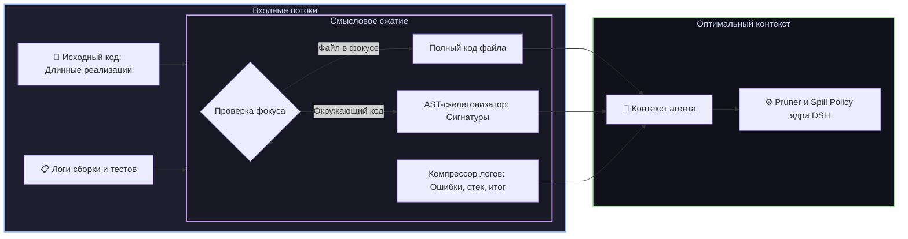

# 📦 @goodandready/dsh-context-lens

<h3>Смысловое AST-сжатие кода и логов тестов для DeepSeek Harness</h3>

  
  
  
  

<!-- Showcase Button -->

  

  <a href="README.md"><b>🇬🇧 English</b></a> •
  <a href="README.ru.md"><b>🇷🇺 Русский</b></a> •
  <a href="README.zh.md"><b>🇨🇳 中文说明</b></a>

<table align="center">
  <tr>
    <td align="center">
      ⭐ <strong>Если вам понравился этот плагин, пожалуйста, поставьте звезду на GitHub</strong> — это показывает, что плагин полезен, и мотивирует развивать его дальше.
        
      🐛 <strong>Нашли ошибку или хотите предложить улучшение?</strong> Откройте issue на GitHub на любом языке — предложения рассматриваются при подготовке будущих версий.
    </td>
  </tr>
</table>

---

## ⚡ Разделение ответственности: Ядро vs Плагин

> **Бюджет контекста и обрезку результатов делает ядро (с 0.1.5). Этот плагин добавляет смысловое сжатие: AST-скелеты кода и сжатие логов тестов.**

Штатные механизмы DeepSeek Harness (`dsh-compaction-tool-result-pruner`, `dsh-spill-policy`, `dsh-token-meter`) автоматически контролируют объем токенов, обрезают хвосты длинных ответов и сбрасывают гигантские дампы на диск. Плагин `dsh-context-lens` решает задачу, которую не может решить механический обрезчик — **смысловую компактификацию**:
1. **AST-скелеты кода**: вместо тел функций и реализаций передаются сигнатуры, интерфейсы, экспортируемые типы и doc-комментарии (JS, TS, Python, Go, Rust, C/C++, Java, SQL).
2. **Фокус на путях**: рабочие файлы сохраняются целиком, а окружающий код проекта сворачивается в скелеты.
3. **Сжатие логов тестов и сборки**: вместо полотен терминала остаются ошибки, стек вызова и сводный итог. Авто-режим срабатывает **до** pruner'а ядра и исключительно на выводах тестов/сборки.

```mermaid
graph LR
    subgraph RawContext [Входные потоки]
        Code[📁 Исходный код: Длинные реализации] --> Lens[Движок dsh-context-lens]
        Logs[📋 Логи сборки и тестов] --> Lens
    end

    subgraph Lens [Смысловое сжатие]
        Lens --> Focus{Проверка фокуса}
        Focus -->|Файл в фокусе| FullCode[Полный код файла]
        Focus -->|Окружающий код| AST[AST-скелетонизатор: Сигнатуры]
        Lens --> LogCompress[Компрессор логов: Ошибки, стек, итог]
    end

    subgraph Output [Оптимальный контекст]
        FullCode --> Agent[🤖 Контекст агента]
        AST --> Agent
        LogCompress --> Agent
        Agent --> Core[⚙️ Pruner и Spill Policy ядра DSH]
    end

    style RawContext fill:#1e1e2e,stroke:#89b4fa,stroke-width:2px,color:#cdd6f4
    style Lens fill:#181825,stroke:#cba6f7,stroke-width:2px,color:#cdd6f4
    style Output fill:#11111b,stroke:#a6e3a1,stroke-width:2px,color:#cdd6f4
```

---

## 🛠️ Инструменты агента (2 консолидированных инструмента)

Инструменты строго соблюдают контракт DSH: `output.render` возвращает массив `ContentBlock[]` (`[{ type: 'text', text: ... }]`).

| Инструмент | Действие / Режим | Параметры | Описание |
|---|---|---|---|
| `context_lens_code` | `action: "skeleton"` (по умолчанию) | `code`, `language?`, `maxDepth?`, `filePath?`, `sessionId?` | Генерирует структурный AST-скелет из кода (или возвращает полный код, если файл находится в фокусе сессии) |
| `context_lens_code` | `action: "focus"` | `paths: string[]`, `sessionId?` | Задает список путей активного фокуса для текущей сессии |
| `context_lens_code` | `action: "get_focus"` | `sessionId?` | Возвращает текущее состояние фокуса для сессии |
| `context_lens_code` | `action: "clear_focus"` | `sessionId?` | Очищает пути фокуса сессии |
| `context_lens_log` | N/A | `text` *(или `log`)*, `mode?`, `maxLines?`, `auto?`, `command?` | Сжимает вывод тестов и сборки, сохраняя ошибки, стеки и итог. В режиме `auto: true` применяется только к выводу тестов/сборки |

---

## ⚙️ Настройки плагина

Настраивается через страницу настроек DSH (`plugins.row.config` / `plugins.item`):

| Поле | Тип | По умолчанию | Описание |
|---|---|---|---|
| `compressionMode` | `string` | `'balanced'` | Агрессивность сжатия логов (`raw`, `balanced`, `aggressive`) |
| `astSkeletonMaxDepth` | `number` | `3` | Максимальная глубина вложенности AST-скелета |
| `autoCompressThreshold` | `number` | `4000` | Порог в символах для автосжатия логов тестов/сборки (0 для отключения) |

---

## 📄 Лицензия

MIT © [GooDAnDReaDY](https://github.com/GooDAnDReaDY)