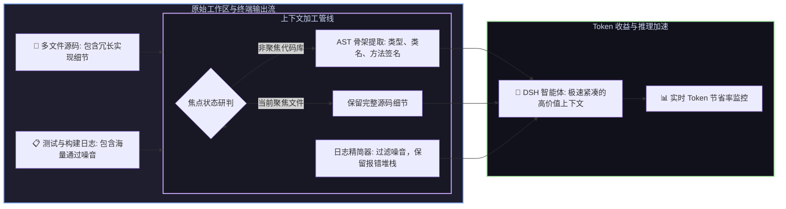

# 📦 @goodandready/dsh-context-lens

<div align="center">

<h3>DeepSeek Harness 智能 AST 代码骨架提取器、上下文 Token 压缩与日志精简插件</h3>

<p align="center">
  <a href="https://www.npmjs.com/package/@goodandready/dsh-context-lens"></a>
  <a href="LICENSE"></a>
  <a href="https://github.com/topics/dsh-plugin"></a>
  <a href="https://nodejs.org"></a>
</p>

<!-- 官方展示中心跳转按钮 -->
<p align="center">
  <a href="https://goodandready.app/"></a>
</p>

<p align="center">
  <a href="README.md"><b>🇬🇧 English</b></a> •
  <a href="README.ru.md"><b>🇷🇺 Русский</b></a> •
  <a href="README.zh.md"><b>🇨🇳 中文说明</b></a>
</p>

</div>

---

## ⚡ 插件概览

**`dsh-context-lens`** 为 **DeepSeek Harness** 智能体提供深度上下文窗口与 Token 预算优化。

超长上下文不仅消耗高昂 Token 成本，还会导致模型注意力涣散并频繁触发限流。本插件通过**工作区文件焦点聚焦、跨语言 AST 结构骨架提取（支持 JS/TS/Python/Go）以及 $O(n)$ 终端测试日志启发式精简**，在保留 100% 架构接口与错误堆栈的前提下，将上下文体积削减**高达 85%**。



---

## 📦 安装指南

```bash
dsh plugin --profile web add @goodandready/dsh-context-lens
```

---

## 📄 开源协议

MIT © [GooDAnDReaDY](https://github.com/GooDAnDReaDY)
