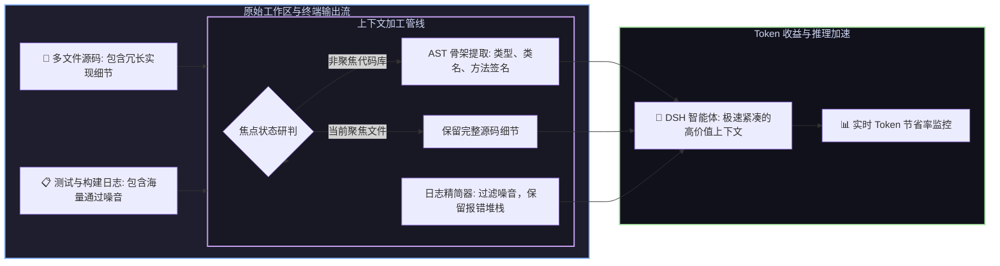

# 📦 @goodandready/dsh-context-lens

<div align="center">

<h3>DeepSeek Harness 智能 AST 代码骨架提取器、上下文 Token 压缩与日志精简插件</h3>

<p align="center">
  <a href="https://www.npmjs.com/package/@goodandready/dsh-context-lens"></a>
  <a href="LICENSE"></a>
  <a href="https://github.com/topics/dsh-plugin"></a>
  <a href="https://nodejs.org"></a>
</p>

<!-- 官方展示中心跳转按钮 -->
<p align="center">
  <a href="https://goodandready.app/"></a>
</p>

<p align="center">
  <a href="README.md"><b>🇬🇧 English</b></a> •
  <a href="README.ru.md"><b>🇷🇺 Русский</b></a> •
  <a href="README.zh.md"><b>🇨🇳 中文说明</b></a>
</p>

<table align="center">
  <tr>
    <td align="center">
      ⭐ <strong>如果您喜欢这个插件，请在 GitHub 上为它点亮 Star</strong> — 这能让我知道插件对您有用，并鼓励我继续开发和维护它。
      <br><br>
      🐛 <strong>如果您发现 Bug 或希望增加功能</strong>，请使用任意语言在 GitHub 上提交 Issue — 我会评估您的建议，并在后续版本中实现有价值的改进。
    </td>
  </tr>
</table>

</div>

---

## ⚡ 插件概览

**`dsh-context-lens`** 为 **DeepSeek Harness** 智能体提供深度上下文窗口与 Token 预算优化。

超长上下文不仅消耗高昂 Token 成本，还会导致模型注意力涣散并频繁触发限流。本插件通过**工作区文件焦点聚焦、跨语言 AST 结构骨架提取（支持 JS/TS/Python/Go/Rust/Java/C/C++/SQL）以及 $O(n)$ 终端测试日志启发式精简**，在保留 100% 架构接口与错误堆栈的前提下，将上下文体积削减**高达 85%**。



---

## 📦 安装指南

```bash
dsh plugin --profile web add @goodandready/dsh-context-lens
```

---

## 📄 开源协议

MIT © [GooDAnDReaDY](https://github.com/GooDAnDReaDY)


## v0.1.18 更新日志

- **严重问题修复 (#71, GH #2)**：严格遵循 DeepSeek Harness 核心工具返回规范，将 `output.render` 调整为返回 `ContentBlock[]` 数组 (`[{ type: 'text', text: ... }]`)。彻底解决第三方工具调用后会话写入非数组导致 `@deepseek-ai/dsh-llm` 报错 `TypeError: content.some is not a function` 并永久损坏会话的严重缺陷。
- **安全性与稳定性加固 (#62, #63, #70)**：全面加固 HTTP 接口 (`/clear-focus`, `/compress-preview`, `/status`)：写操作严格要求 `POST` 请求，校验环回与同源请求来源，限制请求体上限为 256KB（超限返回 413），限制 `maxLines` 范围为 1–5000，无效 session 参数返回规范 400 错误。
- **一键在线更新支持 (#61)**：引入标准更新管理模块 (`lib/updater.js`) 及 `/api/dsh-context-lens/update` 接口，在设置卡片中增加版本检查与一键更新按钮。
- **设置域与生命周期规范 (#64, #66)**：客户端显式声明 `settingsScope` 依赖并移除对外部 `lanSettings` 的隐式依赖，将设置注册与多语言注册统一纳入 `ctx.effect` 生命周期清理管理。
- **UI 与主题深度适配 (#67, #68)**：将折叠箭头升级为 14x14 矢量 SVG 并支持平滑 180° 旋转动画，全面替换硬编码色值，使用 `--dsw-alias-*` 主题变量完美适配明暗主题。
- **仓库代码纯净性 (#65)**：从 Git 跟踪树中彻底剥离内部计划文件 (`AGENTS.md`, `index.md`, `docs/plans/`)，并更新 `.gitignore` 防护清单。
