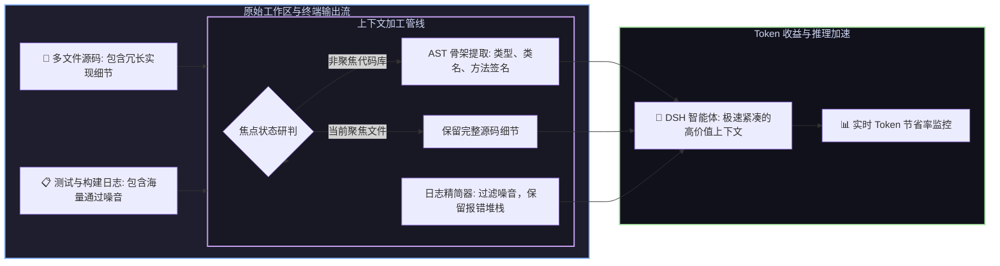

# 📦 @goodandready/dsh-context-lens

<div align="center">

<h3>DeepSeek Harness 智能 AST 代码骨架提取器、上下文 Token 压缩与日志精简插件</h3>

<p align="center">
  <a href="https://www.npmjs.com/package/@goodandready/dsh-context-lens"></a>
  <a href="LICENSE"></a>
  <a href="https://github.com/topics/dsh-plugin"></a>
  <a href="https://nodejs.org"></a>
</p>

<!-- 官方展示中心跳转按钮 -->
<p align="center">
  <a href="https://goodandready.app/"></a>
</p>

<p align="center">
  <a href="README.md"><b>🇬🇧 English</b></a> •
  <a href="README.ru.md"><b>🇷🇺 Русский</b></a> •
  <a href="README.zh.md"><b>🇨🇳 中文说明</b></a>
</p>

<table align="center">
  <tr>
    <td align="center">
      ⭐ <strong>如果您喜欢这个插件，请在 GitHub 上为它点亮 Star</strong> — 这能让我知道插件对您有用，并鼓励我继续开发和维护它。
      <br><br>
      🐛 <strong>如果您发现 Bug 或希望增加功能</strong>，请使用任意语言在 GitHub 上提交 Issue — 我会评估您的建议，并在后续版本中实现有价值的改进。
    </td>
  </tr>
</table>

</div>

---

## ⚡ 插件概览与问题背景

超长代码库上下文与冗长的构建/测试输出流会迅速填满大语言模型的上下文窗口，造成严重的 Token 资金浪费、显著增加推理延迟，并导致智能体注意力涣散与幻觉。

**`dsh-context-lens`** 提供了完整的上下文优化管线：
1. **工作区焦点聚焦 (`context_lens_focus`)**：对当前正在编辑的核心文件保持 100% 完整源码，将其余依赖代码库自动精简为轻量级 AST 骨架。
2. **多语言 AST 结构骨架化**：支持 TypeScript, JavaScript, Python, Go, C/C++, Rust, SQL DDL，完整保留类型、类结构与函数签名，将源码体积削减 **70–85%**。
3. **启发式测试日志压缩**：自动消除测试通过的冗余输出，精准萃取关键报错堆栈、断言差异与失败上下文，将日志体积削减高达 **90%**。
4. **会话 Token 遥测与预算守卫**：实时精确统计压缩前后节省的 Token 数量，支持自定义预算水位预警并在 DSH 界面直观显示。



---

## ✨ 核心特性深度解析

### 1. 🧬 跨语言 AST 结构骨架提取器
* **支持语言**：TypeScript, JavaScript, Python, Go, C/C++, Rust 以及 SQL DDL。
* **架构完整性**：保留所有模块导入、类定义、接口、导出类型、函数签名与文档注释，剔除内部庞大实现细节。
* **多行签名提取**：无缝解析复杂的跨行泛型参数、长参数列表与返回类型注解。
* **纯正则轻量化实现**：零重型原生依赖，零二进制解析器包袱，极速跨平台运行。

### 2. 📋 启发式终端日志精简引擎
* **支持测试与构建工具**：Jest, Vitest, Pytest, Go test, Cargo, Webpack, Vite, TSC, Maven, Gradle。
* **定向错误萃取**：精准识别报错摘要、异常调用堆栈、断言匹配差异 (`Expected ... Received ...`) 与错误上下文窗口。
* **3 种压缩模式**：
  - `raw`：过滤基础噪音行，保留总体执行日志。
  - `balanced`：在压缩率与报错上下文之间保持平衡（默认推荐）。
  - `aggressive`：严格仅保留报错行与堆栈帧。
* **ANSI 码清理**：预先剥离终端控制字符与彩色 ANSI 转义序列。

### 3. 🎯 会话文件焦点范围管理 (`context_lens_focus`)
* 允许针对当前任务设定一组活跃聚焦文件或目录。
* 焦点文件保持完整代码，未聚焦文件自动折叠为 AST 结构骨架。
* 焦点状态在会话级别严格隔离 (`sessionId`)，可通过 UI 或 API 一键清除。

### 4. 📊 Token 消耗遥测与预算守卫
* 采用精准分词估算逻辑，实时计算压缩前后的 Token 变化。
* 统计累计节省 Token、压缩比率与会话预算百分比。
* 支持设置预警阈值 (`budgetAlertPercent`)，预算临界时动态发出提示。

### 5. 🖥️ 视觉界面与双侧边栏原生集成
完全遵循 `.cl-*` 设计标准与 DeepSeek Harness `--dsw-alias-*` 主题变量系统：
* **对话顶栏微件**：挂载于 `conversation.session.header.utilities` 槽位（`order: 7`）。常态化显示效率徽章（`◐ Lens`, `◐ <N>%` 或 `⚠` 警告），点击展开包含详细数据与操作记录的交互式 Popover。
* **双侧边栏深度兼容**：同时支持 DSH 原生右侧边栏（`ctx.sidebarRightTabs` + `sidebar.right.pane.tab`）及旧版 `dsh-better-sidebar`，独立 ID 互不冲突。
* **ErrorBoundary 容灾屏障**：所有视图组件（`PluginCard`, `LensTab`, `StatusPanel`）均包裹在独立 React 错误边界内，避免页面崩溃。
* **一键平滑升级**：设置卡片实时检测 npm 最新版本并支持免命令行一键升级。

---

## 🛠️ 智能体工具参考 (5 Tools)

所有工具严格遵循 DeepSeek Harness 核心工具契约规范，`output.render` 均返回规范的 `ContentBlock[]` 数组 (`[{ type: 'text', text: ... }]`)，保障底层会话日志投影 100% 稳定可靠。

| 工具名称 | 参数 | 说明 |
|---|---|---|
| `context_lens_focus` | `paths: string[]`, `sessionId?: string` | 设定当前会话的活跃聚焦文件/路径；未聚焦代码自动折叠为 AST 骨架 |
| `context_lens_compress_log` | `text: string` *(或 `log`)*, `mode?: "raw"|"balanced"|"aggressive"`, `maxLines?: number`, `auto?: boolean` | 精简终端与测试输出日志，仅保留核心错误信息与报错堆栈 |
| `context_lens_compress_code` | `code: string`, `language?: string`, `maxDepth?: number`, `filePath?: string`, `sessionId?: string` | 将源代码提炼为紧凑的结构化 AST 骨架 |
| `context_lens_track` | `sessionId?: string` | 获取当前会话的累计 Token 节省统计、历史记录与预算状态 |
| `context_lens_reset` | `sessionId?: string` | 开启新任务时重置 Token 追踪计数器与历史记录 |

---

## 🔌 HTTP 接口参考

| 路由 | 请求方法 | 权限与安全策略 | 功能说明 |
|---|---|---|---|
| `/dsh-context-lens/status` | `GET` | 开放只读 | 查询会话 Token 节省数据、当前焦点路径与操作历史 |
| `/dsh-context-lens/clear-focus` | `POST` | 仅限环回 (Loopback) / 同源 | 清除指定会话的焦点路径设置（GET 请求返回 405） |
| `/dsh-context-lens/compress-preview` | `POST` | 仅限环回 / 同源 | 日志压缩预览（限制请求体 256KB，`maxLines` 范围 1–5000） |
| `/api/dsh-context-lens/update` | `GET`, `POST` | 环回 + 安全请求头校验 | 应用内一键升级模块，安全调用后台进行版本更新 |

---

## ⚙️ 配置面板参考 (`settings.yaml`)

可通过 `settings.yaml` 或在 DSH Web 界面中的 **设置 → 插件设置 → Context Lens** 进行配置。

```yaml
dsh-context-lens:
  compressionMode: balanced        # 日志精简策略: 'raw', 'balanced', 或 'aggressive'
  astSkeletonMaxDepth: 3          # AST 结构骨架最大解析深度 (1..10)
  tokenSavingsTracking: true      # 开启并展示实时 Token 节省监控
  autoCompressThreshold: 4000     # 自动触发日志精简的字符长度阈值 (设为 0 禁用)
  budgetLimit: 100000             # 单会话 Token 预算上限限额
  budgetAlertPercent: 90          # 触发预警徽章的预算百分比水位 (50..99)
  autoCollapse: true              # 预算临界时在界面显示警告徽章
```

| 参数项 | 类型 | 默认值 | 功能说明 |
|---|---|---|---|
| `compressionMode` | `string` | `balanced` | 默认日志压缩激进度 (`raw`, `balanced`, `aggressive`) |
| `astSkeletonMaxDepth` | `number` | `3` | AST 骨架提取最大深度层级（1 至 10） |
| `tokenSavingsTracking` | `boolean` | `true` | 实时追踪压缩前后的 Token 节省数据 |
| `autoCompressThreshold` | `number` | `4000` | 超过该字符长度时自动执行日志压缩 |
| `budgetLimit` | `number` | `100000` | 单会话分配的最大 Token 预算上限 |
| `budgetAlertPercent` | `number` | `90` | 触发低预算预警的百分比阈值（50 至 99） |
| `autoCollapse` | `boolean` | `true` | 在设置卡片与顶栏徽章中显示预算告急提示 |

---

## 📦 快速安装

```bash
dsh plugin --profile web add @goodandready/dsh-context-lens
```

> [!TIP]
> 安装完成后，请刷新 DSH Web 界面或重启服务 (`systemctl --user restart dsh-web`) 以激活上下文压缩工具。

---

## 📄 开源协议

MIT © [GooDAnDReaDY](https://github.com/GooDAnDReaDY)
