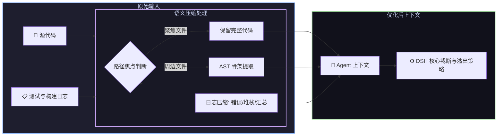

# 📦 @goodandready/dsh-context-lens

<h3>DeepSeek Harness 语义 AST 代码骨架提取与测试日志压缩插件</h3>

  
  
  
  

<!-- Showcase Button -->

  

  <a href="README.md"><b>🇬🇧 English</b></a> •
  <a href="README.ru.md"><b>🇷🇺 Русский</b></a> •
  <a href="README.zh.md"><b>🇨🇳 中文说明</b></a>

<table align="center">
  <tr>
    <td align="center">
      ⭐ <strong>如果您喜欢本插件，请在 GitHub 上点亮 Star</strong> —— 这能让我了解插件对您有所帮助，并激励我持续维护和演进它。
        
      🐛 <strong>如遇问题或有功能建议</strong>，欢迎使用任意语言提交 GitHub Issue —— 您的所有实用建议都将在后续版本中得到评估和实现。
    </td>
  </tr>
</table>

---

## ⚡ 核心定位与职责划分

> **说明：**  
> 上下文预算控制、Token 计数、工具输出头尾截断 (`dsh-compaction-tool-result-pruner`) 以及大文件溢出落盘 (`dsh-spill-policy`, `dsh-token-meter`) 由 **DSH 核心引擎 (>= 0.1.5)** 原生负责。  
> **`dsh-context-lens`** 专注于核心不具备的能力 —— **语义压缩**：
> 1. **AST 代码骨架生成**：提取函数签名、接口、类型定义及文档注释，去除冗长实现体（支持 9+ 种语言）。
> 2. **焦点路径机制**：正在编辑的文件保留全量内容，周边工作区文件生成骨架。
> 3. **测试与构建日志压缩**：保留失败信息、错误栈及汇总结果，剔除冗余输出。

```mermaid
graph LR
    subgraph RawContext [原始输入]
        Code[📁 源代码] --> Lens[dsh-context-lens 语义引擎]
        Logs[📋 测试与构建日志] --> Lens
    end

    subgraph Lens [语义压缩处理]
        Lens --> Focus{路径焦点判断}
        Focus -->|聚焦文件| FullCode[保留完整代码]
        Focus -->|周边文件| AST[AST 骨架提取]
        Lens --> LogCompress[日志压缩: 错误/堆栈/汇总]
    end

    subgraph Output [优化后上下文]
        FullCode --> Agent[🤖 Agent 上下文]
        AST --> Agent
        LogCompress --> Agent
        Agent --> Core[⚙️ DSH 核心截断与溢出策略]
    end

    style RawContext fill:#1e1e2e,stroke:#89b4fa,stroke-width:2px,color:#cdd6f4
    style Lens fill:#181825,stroke:#cba6f7,stroke-width:2px,color:#cdd6f4
    style Output fill:#11111b,stroke:#a6e3a1,stroke-width:2px,color:#cdd6f4
```

---

## 🛠️ Agent 工具参考 (归并至 2 个工具)

所有工具完全符合 DeepSeek Harness 规范，`output.render` 统一返回 `ContentBlock[]` 数组。

| 工具名 | 操作模式 | 参数 | 描述 |
|---|---|---|---|
| `context_lens_code` | `action: "skeleton"` (默认) | `code`, `language?`, `maxDepth?`, `filePath?`, `sessionId?` | 从源代码生成 AST 骨架（若文件处于焦点内则返回完整代码） |
| `context_lens_code` | `action: "focus"` | `paths: string[]`, `sessionId?` | 设置当前会话的焦点路径列表 |
| `context_lens_code` | `action: "get_focus"` | `sessionId?` | 获取当前会话的焦点状态 |
| `context_lens_code` | `action: "clear_focus"` | `sessionId?` | 清空当前会话的焦点路径 |
| `context_lens_log` | N/A | `text` *(或 `log`)*, `mode?`, `maxLines?`, `auto?`, `command?` | 压缩测试或构建日志，保留错误、堆栈及总结信息 |

---

## ⚙️ 配置项

在 DSH 设置中心 (`plugins.row.config` / `plugins.item`) 中配置：

| 配置项 | 类型 | 默认值 | 描述 |
|---|---|---|---|
| `compressionMode` | `string` | `'balanced'` | 日志压缩模式 (`raw`, `balanced`, `aggressive`) |
| `astSkeletonMaxDepth` | `number` | `3` | AST 骨架最大嵌套深度 |
| `autoCompressThreshold` | `number` | `4000` | 自动压缩触发字符阈值（设为 0 禁用） |

---

## 📄 授权协议

MIT © [GooDAnDReaDY](https://github.com/GooDAnDReaDY)